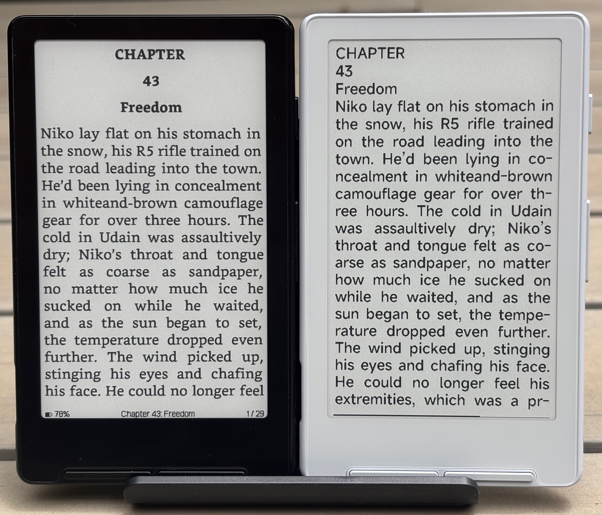
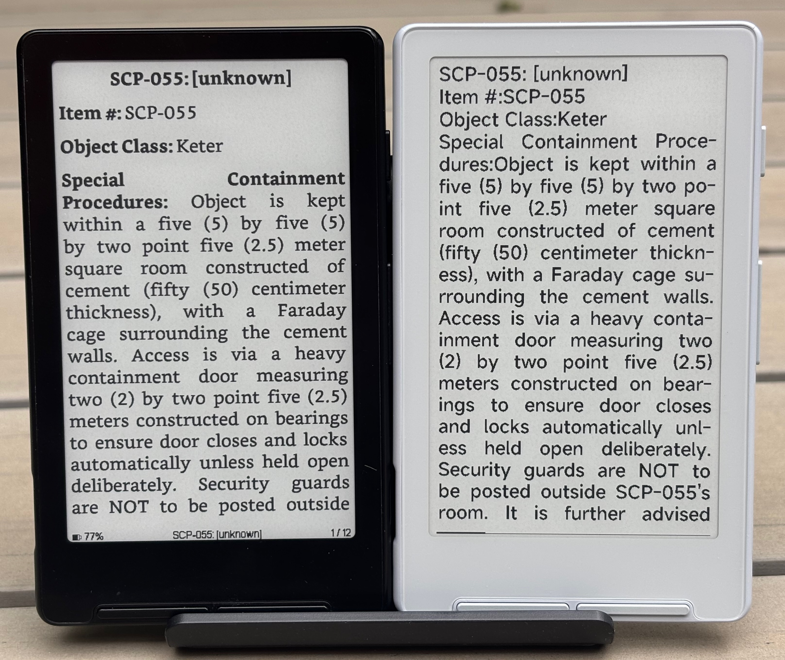
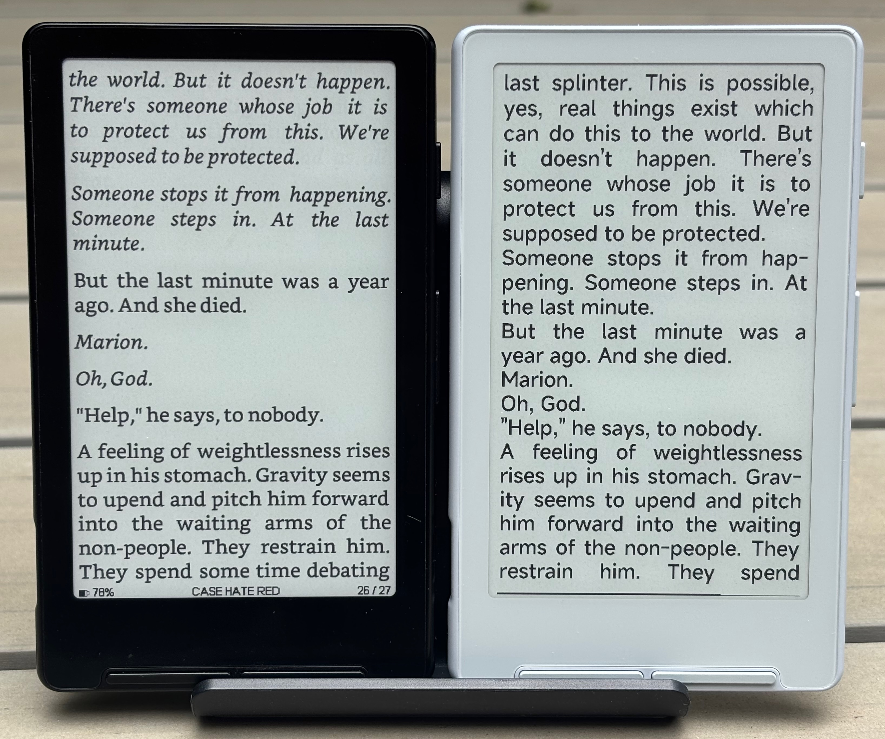
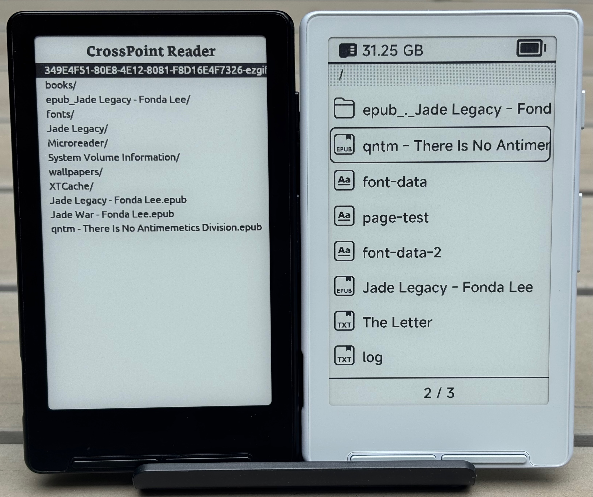
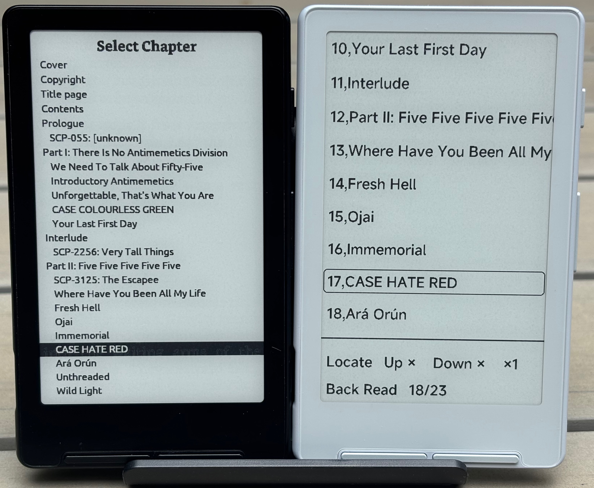

# CrossPoint-Mod-DX34 vs XTOS

Below is a like-for-like historical visual comparison of CrossPoint-Mod-DX34 and XTOS. Images may reflect earlier
development builds, but still show the main reader/menu style differences.

## EPUB reading

## Menus

